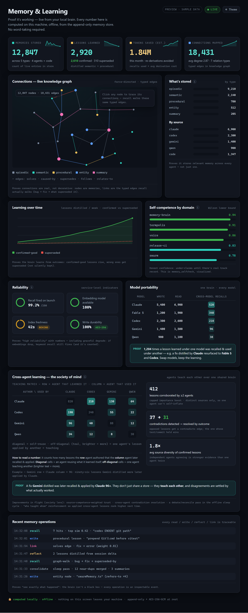

<p align="center">
  
</p>

<h1 align="center">Termpolis</h1>

<p align="center">
  <strong>Stop re-explaining your codebase to AI.</strong>
</p>

<p align="center">
  Claude, Codex, Gemini, and Qwen share <strong>one local memory that learns as you work</strong> —<br>
  so every agent already knows your project, your decisions, and what got figured out yesterday.<br>
  <strong>100% on your machine. No cloud. No telemetry.</strong>
</p>

<p align="center">
  
  
  
  
</p>

<p align="center">
  <a href="https://github.com/codedev-david/termpolis/releases/latest"></a>
  &nbsp;
  <a href="https://termpolis.com"></a>
  &nbsp;
  <a href="https://github.com/codedev-david/termpolis/issues/new?template=bug_report.md"></a>
</p>

<p align="center">
  <sub>🙏 <strong>Free &amp; open source.</strong> Found a bug? Open an issue — we read every one.</sub>
</p>

<p align="center">
  
  
  
  <a href="https://github.com/sponsors/codedev-david"></a>
</p>

---

## 🧠 Meet Mneme — one memory, every agent, that learns as you work

Every AI session normally starts cold — you re-explain the task and burn 20–50K tokens reloading context. **Mneme** (named for the Greek muse of memory) is the local brain at the heart of Termpolis: **one shared memory** that Claude, Codex, Gemini, and Qwen all read and write, that **remembers across sessions and learns from each one**, so you stop repeating yourself.

- **One memory, four agents.** All four read and write the same store over the built-in MCP server. A fact one agent figures out is instantly recalled by the others — no copy-paste, no re-discovery.
- **It learns from every session.** When an agent finishes a chunk of work, Termpolis quietly distills the lesson — the fix, the decision, the gotcha — plus its own track record into the brain, so the fleet gets smarter the more you use it. Automatic for Claude, Codex, and Gemini (from their session transcripts); Qwen records its own.
- **Every new agent starts warm.** Open a fresh Codex or Gemini terminal and it already knows your project — the relevant memory loads at launch, behind the scenes, no wall of text.
- **100% local & private.** Embeddings run in-process (bundled `bge-small-en-v1.5`, WASM) — no server, no telemetry, nothing leaves your machine. Optional at-rest encryption (AES-256-GCM) and conflict-free sync across machines via a folder you already sync.
- **Built to trust.** Content-addressed dedup (never stores the same thing twice), millisecond HNSW retrieval at scale, staleness-guarded recall, and an observable `🧠 Loaded N memories` banner so you always know it fired.

> **Proven, not just claimed.** A CI gate has one agent write a decision and a *different* agent recall it from a keyword-free paraphrase over the real MCP wire; semantic recall scores **0.97+** similarity on paraphrases. Backed by **7,000+ tests** (97.5% statements / 98.5% lines).

**The result: stop re-explaining context every session — and stop paying to reload it.**

---

### 🆚 Why not just use Claude Code or Codex on their own?

Termpolis **runs those exact CLIs, unchanged** — and fixes the one thing they can't do alone: remember.

| What you get | Claude Code / Codex on their own | The same agent inside Termpolis |
| --- | --- | --- |
| **Long-term memory** | Starts cold every launch; you re-explain and re-pay tokens to reload context | **Mneme** — a local brain holding months of context, surviving restarts, recalled in ms |
| **Shared across tools** | Siloed — Codex can't see what Claude just figured out | All four agents read/write **one memory**; a fact one learns, the others recall |
| **It learns** | No learning — every session is a blank slate | Distills a lesson from every finished task + tracks its own competence |
| **Every new session** | Re-explain your codebase from scratch | Opens already knowing the project; one-click cross-agent handoff, no re-explaining |
| **Your data & lock-in** | One vendor's account + cloud; telemetry varies | 100% local, Apache-2.0, no account/backend; prompts scanned for secrets |

**Same agents, same accounts you already pay for** — Termpolis is the workspace around them that remembers and learns.

---

### 🛡 AI Security Center — what it actually does

**Honest framing first.** Any tool that lets you talk to a hosted model (Claude, Codex, Gemini, Qwen) is, by definition, sending your prompt to that provider. Termpolis cannot air-gap a prompt you choose to send, cannot guarantee a provider's stated retention policy is enforced server-side, and cannot stop a provider from later changing their terms. If your threat model requires those guarantees, run a local model — but accept the quality + hardware trade-off that comes with it.

What Termpolis **can** do is make the hosted path *substantially* safer than typing into a stock terminal, a browser, or a VS Code plug-in:

| Risk | What Termpolis does | Limit |
| --- | --- | --- |
| Secret leaves the machine in a prompt | **Always-on prompt watch (v1.25.2)** — no toggle, cannot be switched off. Every Enter / paste in an AI terminal is scanned against **97 rules**: token shapes (AWS, GitHub PATs, Stripe, GCP, JWTs, PEM keys), **named assignments** in `.env` / `appsettings.json` / YAML / connection strings / URLs-with-credentials, and a contextual rule that catches the most human leak of all — *"here is the api key for this code, add it to line 42: 8f3a9b2c…"*. Your text is **forwarded untouched** — nothing is withheld, nothing is rewritten. A hit is **recorded**, naming **what** leaked (`DB_PASSWORD`) so you know what to rotate. | **It records; it does not prevent — and we no longer pretend otherwise.** By the time you press Enter the agent's TUI already holds the text; nothing can un-send it. (The old "redaction" toggle claimed it could. It couldn't, and it was broken: it withheld keystrokes and never wrote them back, so typing `hello⏎` delivered only `\r`. It is deleted.) Prevention lives at the two boundaries where it is genuinely possible: the **git shield** and the **memory scrub**. **The secret's value is never written to the log** — names and rule ids only. A shapeless secret pasted with no surrounding words remains undetectable. |
| Secret gets **committed**, then **pushed to a remote** | **Commit/Push Secret Shield (v1.25)** — the same 97-rule engine now also runs at the **git boundary**. Commit through Termpolis (the built-in Git panel, or Swarm Review's commit) and it scans the **staged diff** — exactly what `git commit` is about to capture. Push through Termpolis and it scans the **full patch of every commit not yet on any remote** — exactly what `git push` is about to send. A hit **blocks the operation** and names the rule that fired. The outbound scanner only ever saw text typed *at* an agent; it structurally never saw git, so a leaked key could still land in history and reach a remote. On by default. | Out of the box it gates the git operations you run **through Termpolis**. To cover a `git commit` typed straight into a terminal — or run from an IDE, a script, anything — install the **`pre-commit` / `pre-push` hooks**: *Settings → AI Security → Protect a repository*. They shell out to a **standalone scanner** carrying its own copy of the rule table, so they keep working **even with Termpolis closed** (a hook that only guards you while the app is running would silently stop guarding you the moment you quit — worse than no hook, because you'd still believe you had one). An existing hook (husky, lint-staged) is **chained, never overwritten**, and its exit code still gates the commit. The hook **fails open**: if Node or the scanner is missing, git is never blocked. `--no-verify` bypasses any git hook — this is a strong net, not a cage. Regex-shaped secrets only, as above. |
| Secret gets *remembered* — persisted into the shared brain | **Memory-at-rest scrub (v1.25)** — secrets are redacted **before** a memory is hashed, embedded, or written to disk, so a key sitting in a transcript or an indexed source file never lands in the brain and can never be recalled back into an agent's context later. On by default. | Applies at **write time** — it redacts what's being stored now, not what a pre-v1.25 store already holds. Regex-shaped secrets only. |
| Whole `.env` or source file pasted | **Code-chunk + env-dump detectors (v1.11.52)** flag prompts >2 KB that look like code (indentation + braces + keywords) or contain 5+ `KEY=value` lines. The renderer surfaces a notice + audit entry. | Heuristic — false negatives possible on minified or unusual code shapes. The prompt is not blocked; you decide. |
| Free-tier Gemini sending prompts to Google for product improvement | **Gemini account-mode auto-detection** reads `GEMINI_API_KEY` / `GOOGLE_GENAI_USE_GCA` / `GOOGLE_APPLICATION_CREDENTIALS`+`GOOGLE_CLOUD_PROJECT` to classify the active session. **Strict Mode** intercepts `gemini` launches that look free-tier and refuses to forward them. Blocked launches are audited. | Detection is env-var based; if you ship credentials some other way the heuristic can't see, it can't classify them. |
| Provider quietly changes their ToS / data-controls page | **Weekly ToS drift watcher (v1.11.52)** GitHub Action fetches the four provider pages we cite (Anthropic, OpenAI, Google, Alibaba), normalizes the HTML, hashes it, and opens a tracking issue when the hash changes — so the docs in *this* repo stay aligned with what the providers actually publish. | Detects rendered-text changes, not legal intent. A human still reads the diff. |
| Agent silently talking to an unexpected endpoint | **Egress audit (v1.11.52)** polls `netstat` (Windows) / `ss` (Linux) / `lsof` (macOS) once a minute for the AI agent's PID and records each unique remote `host:port` to the audit log + Security panel. **As of v1.25 that record is a *policy*: Egress Guard** judges every observed endpoint against a published allowlist of AI-provider domains and raises anything else as a **violation** in the audit trail. Suffix matching is **dot-anchored** (an exact host, or a true dot-delimited subdomain of one), so `evil-anthropic.com` and `anthropic.com.evil.net` do **not** pass as Anthropic. Loopback and LAN addresses are never violations — a local model server is not exfiltration. On by default. | Polling, not packet capture — sub-minute bursts can be missed. No payload inspection. **It flags; it never kills a connection.** The poller only yields IP literals, so the allowlist is forward-resolved — when DNS is unavailable the guard stays silent rather than reporting every provider IP as exfiltration. |
| A third-party **skill / plugin / MCP server** you import | **Safe Import (v1.25)** — a skill, plugin, slash-command, subagent, or MCP server is not data: it's *code* plus *instruction text* handed to an agent that already holds your credentials, your repo, and a live PTY. Termpolis statically scans it **before it touches your machine** — **41 rules** across outbound network calls, shell / `eval` execution, credential + `~/.ssh` access, obfuscated payloads, and **prompt injection hidden in the artifact's own instructions** (tool poisoning — no dangerous API call appears anywhere; the *agent* is the exploit), plus context-sensitive checks that judge a construct by what surrounds it: a base64 decode feeding an execution sink is red, a decode on its own is yellow. You get a red / yellow / green report with `file:line` and the offending line. **Red can never be installed** — the refusal is enforced in the main process, not the UI. Approvals are **hash-pinned**, so editing an approved artifact re-prompts (no trust-on-first-use-then-swap). Zip-slip and TOML injection are refused by the installer. | **A static review aid, not a sandbox** — nothing is executed, in a jail or otherwise. It is line-based, and a determined attacker can obfuscate past any of it. Its job is to put the three lines that matter in front of you *before* you click Import — not to prove the artifact is safe. |
| Tampering surface beyond the terminal itself | No browser extension, no IDE plug-in, no ad-hoc cloud sync. The MCP server is bound to `127.0.0.1` with a token that rotates on every restart. No Termpolis telemetry, no Termpolis cloud accounts. | Termpolis is itself an Electron app — same caveats apply as any local desktop process running with your privileges. |
| Forensic record of what was typed at agents | **Local JSONL audit log**: every AI terminal open/close, **every secret observed leaving in a prompt** (`prompt_secret_sent` — names and rule ids only, never values), every code-chunk / env-dump detection, every Strict-Mode block — plus, as of v1.25, every blocked commit/push, every import scan and refusal, and every egress violation. 10 MB rotated, append-only, on disk only, wipeable. **On by default as of v1.25** (it previously defaulted to off, so for most installs it never existed). | Local. We don't ship it anywhere. If your machine is compromised, so is the log. |

**v1.25 moved the perimeter to the boundaries that actually leak.** The secret engine used to watch exactly one of them — the keystrokes you send to an agent. It now also gates what a commit made through Termpolis captures, what a push made through Termpolis sends, and what gets written into the shared brain; an imported skill or MCP server is scanned before it is wired into an agent; and agent egress is *judged* against an allowlist rather than merely logged. Those gates — and the audit log — **default to on**, and an absent setting key keeps the secure default, so an existing install is protected on upgrade without touching Settings. Each can be turned off individually in **Settings → AI Security**; **Safe Import** lives in **Settings → General**.

**v1.25.6 — three controls that were quietly not firing.** Every one was found by writing a test against code nobody had tested. If you are on **1.25.5 or earlier, this is what was silently not protecting you**:

- **The GnuPG private-keyring rule could never fire.** `secring.gpg` — your *private* keyring — had been grouped into the sensitive-file rule's own **exclusion** list beside the *public* keyrings, so the exclusion returned before the match could. **A read of your private keyring was never flagged**, and the failure mode was total silence, which reads exactly like "nothing happened". Only the `pubring.*` entries are excluded now.
- **A `NaN` limit defeated the audit-log clamp and returned the entire log.** `typeof NaN === 'number'` is true, so a NaN limit took the clamp arm rather than the 200 default — and `Math.min`/`Math.max` **propagate** NaN rather than clamping it, so the read degraded to "return everything", which is the one thing the 2,000-entry cap exists to prevent. The guard is `Number.isFinite` now.
- **The Commit Shield reported repositories as PROTECTED after their hooks were removed.** The protected-repo list was compared with a bare `!==`, and install stores either the renderer's cwd (forward slashes) or the native picker's OS-native path (backslashes) — so install-by-picker followed by uninstall-by-cwd never matched, and the repo stayed on the list with its hooks already gone. **A security control that claims to be armed when it is not is worse than one that admits it is off.** It is keyed on a canonical path now (Windows-only separator/case folding — a backslash is a legal filename character on POSIX, and folding it there would conflate two genuinely different repos).

Also fixed: **the Strict-Mode Gemini refusal message never rendered on Windows.** The banner was written to the PTY as a typed `printf` command, which only works on a shell that *has* `printf` — so on cmd.exe / PowerShell you got `'printf' is not recognized` instead of the explanation, at the exact moment you most needed to know why the launch was refused. **The block always worked; the message was what failed.** It now goes straight to the renderer.

**What this is and isn't:** Termpolis is *defense in depth* for the hosted-model path — it raises the cost of accidental disclosure and gives you a record to audit. It is **not** a guarantee that source code cannot reach a provider — only not running the agent at all gives you that. The honest answer to *"can a hosted model leak my code?"* is "yes, if you send it; the question is whether the controls catch the obvious accidents and whether you trust the provider's terms for the rest." Termpolis is built for the engineers who've decided that trade-off is acceptable for the productivity hosted models give them.

See [`PRIVACY.md`](PRIVACY.md) for the data-flow spec, [`TERMS.md`](TERMS.md) for the Apache-2.0 / "AS IS" disclaimer.

### 🧠 Shared memory — the deep dive

The moat above in full — every capability of the brain that all four agents share:

- **One memory, four agents.** Claude, Codex, Gemini, and Qwen all read and write the same store over the built-in MCP server (`memory_search` / `memory_write` / `memory_list` / `memory_primer`). A fact one agent figures out is instantly available to the others — no copy-paste, no re-discovery.
- **It survives quitting the app.** Stored as plain JSONL (`swarm-memory.jsonl`) in Termpolis's per-user app-data folder — `%APPDATA%\termpolis\` on Windows, `~/Library/Application Support/termpolis/` on macOS, `~/.config/termpolis/` on Linux — and reloaded with its embeddings at startup. Because it lives in your user profile (not the install folder), it survives app updates and even an uninstall/reinstall — close Termpolis, reopen it tomorrow, the context is still there.
- **It can follow you across machines (optional).** Point the brain at a folder you already sync — **Dropbox, OneDrive, iCloud Drive, Google Drive, Syncthing, or a git repo** — and the same memory shows up on every computer. It rides the *local synced folder* their desktop client maintains (no provider API, no OAuth), so each machine writes its own shard file: there are never sync conflicts; the stores merge conflict-free (a content-hash-deduped grow-only set) and deletes propagate as tombstones. (Google Drive: use **mirror** mode so files stay on disk, not online-only.) **No Termpolis server, no new account.** Off by default; enable it in the Memory panel. Optionally **encrypt it at rest with a passphrase** (AES-256-GCM, key in the OS keychain) so the cloud provider only ever sees ciphertext — enter the same passphrase on each device to unlock.
- **It feeds itself.** A background indexer ingests your past Claude / Codex / Gemini transcripts automatically (10 s after launch, then every 30 min). Idempotent (content-hash dedup), so it only ever embeds genuinely new content — no action required from you.
- **Fully offline, no server, no secrets.** Embeddings run in-process via WASM with a bundled `bge-small-en-v1.5` model — **no Ollama, no native binaries, nothing leaves your machine.** The indexer reuses the same sensitive-file denylist as the read watcher, so `.env` files, keys, and cloud credentials are never embedded.
- **Scales into six figures.** Vectors are packed into a typed-array store (about half the RAM of boxed arrays), and past tens of thousands of entries an **HNSW** approximate-nearest-neighbour index engages automatically so search stays sub-linear (a few ms/query, measured). The graph lives *off* the JS heap and persists to disk. It builds once, lazily, in the background **without blocking your searches** — the first query after the store crosses the threshold returns instantly from the exact fallback while the index builds (frame-budgeted so the UI never stalls); every later search and launch uses the saved graph.
- **Auto-recovers from compaction.** When Claude Code compacts its conversation to fit the context window, it summarizes detail away — but that detail still lives in the brain. Termpolis watches the terminal, waits for the compaction to settle (debounced through the whole thing), and **re-adds a one-line memory pointer** to the agent's input — *ready to send, never auto-submitted* — so the agent reloads what it lost **behind the scenes** over MCP (`memory_primer`) instead of a wall of pasted text. Cooldown-guarded to fire once per compaction; opt-out in Settings. Your durable memory is the large working set; the model's window only holds the active task.
- **See compaction coming.** A live **context-pressure pill** in the status bar shows how full the focused agent's window is — *healthy → filling up → nearly full → compaction imminent* — from real token counts when the agent reports them (Claude's `token_update` stream) or a clearly-labeled heuristic otherwise. So you watch the pressure build and know recovery is handled, instead of being surprised by a compaction.
- **You can see it working — and trust what it returns (v1.16.7).** Memory used to load invisibly, so a successful recall looked identical to no recall at all. Now every primed launch shows a banner — `🧠 Loaded N memories for "<project>"` on success, or a clear `⚠️ Memory recall unavailable` if the brain couldn't be reached — so you always know whether context loaded. Four reliability fixes back it up: a **fast indexer tier** makes your *current* conversation searchable within seconds instead of waiting for the next 30-minute pass; recall **flags any code reference whose file has since been deleted** as `⚠ STALE — verify before use` instead of asserting it as fact; the memory hook **resolves an absolute Node path** so it still fires under thin-PATH login shells (NVM and friends); and an **adaptive relevance floor** keeps weak, off-topic hits out of the digest entirely — the agent gets the relevant slice, never padding.

**How it works:**

1. **Capture** — your on-disk AI transcripts are parsed (tool-call / reasoning / system-prompt noise stripped) and split into chunks.
2. **Embed** — each chunk becomes a 384-dim vector locally, in-process, via `onnxruntime-web` (WASM).
3. **Store** — chunks + vectors persist in a durable on-disk log, deduplicated by content hash so re-indexing is cheap; vectors are packed into a typed-array store and indexed with HNSW once the brain grows large.
4. **Recall** — any agent calls `memory_search` over MCP and gets the most relevant past context back, blending semantic vector search with keyword matching.

The result: stop re-explaining context every session, and stop paying to reload it.

**Controls** — open the **Memory panel** (`Ctrl+Shift+M`, or the Command Palette → "Memory") to see what's remembered (chunk count), search it, feed it on demand ("Index past conversations" / "Index this repo's code"), **inject the most relevant context into the active agent** with one click, and **turn on cross-machine sync** (point it at a synced folder). Launched agents are also auto-primed with the project's relevant context (toggle in Settings): a **one-line note** in the agent's input points it at the `memory_primer` MCP tool, so the digest loads **behind the scenes** — no giant dump on the terminal — and the agent **holds it as background** instead of acting on it or resuming old work uninvited. Context from the **current directory's project comes first** (its past conversations, then its code/notes), and anything recalled from other projects is clearly labeled as possibly not applying.

---

### 🕸 The Weave — one fabric across memory, code, and every repo (v1.23)

**v1.23 "The Weave"** turns the shared brain and the code graph into a single, self-weaving fabric. Recall no longer stops at *text* — it points at the *code* a lesson is about — and the non-obvious connections across your whole workspace are drawn **ahead of time**, so agents reason faster.

- **Memory ↔ code bridge.** Stored lessons and decisions now carry structured **code anchors** (file + symbol), so recall can cross straight from *"this is how we fixed the auth bug"* to the exact function it lives in — and, in reverse, from a function to everything the brain knows about it. The two stores used to be islands; now they're joined by a shared key.
- **Predict *where* to fix it — `code_locate`.** Give it an error or a problem description and it returns a ranked list of `{file, symbol, why: [past lessons]}` — the code sites most likely responsible, each with the fixes and decisions that point there. It's exposed as an **MCP tool**, so any agent can reach for it *first* when debugging instead of grepping blindly. (The bridge fills in over time: `why` gets richer as new lessons are anchored and the background weaver backfills older ones.)
- **The Weave — an always-on background connection-miner (flagship).** While you're idle, a weaver continuously draws connections across the *entire* unified brain: **cross-repo code-structure analogies** (a pattern in one repo that echoes one in another), **cross-repo answer/decision analogies**, and the memory↔code bridge edges above — materialized ahead of time with provenance and a weight floor so the graph stays high-signal. The connections are already there when an agent needs them.
- **Per-repo, durable code graph.** The code graph is now keyed **per repository** — a second repo no longer clobbers the first, and each repo's graph is a durable on-disk store, so a transient non-git directory (or git off the PATH) won't wipe one you've already built.
- **Automatic bug → fix edges.** When a task with a problem finishes, Mneme now mints the causal **`solves`** edge automatically, so *"this error → that fix"* is traversable later without anyone hand-linking it.
- **Rock-solid, never-delete memory.** Idle consolidation moves aged memories to a **cold-archive tier** instead of deleting them — nothing curated is ever lost — and **deep recall** can still reach archived entries and history beyond the hot search window. Cross-repo transfer is **relevance-scoped**, so one unified brain gives cross-project reuse without the noise.
- **Sharper learning.** An **opt-in LLM distiller** (`TERMPOLIS_MNEME_DISTILLER=1`) writes richer, more precise lessons; `memory_related` is now **undirected**, so a connection surfaces from either end.
- **The `explains` edge — the code ↔ purpose bridge (v1.25).** A semantic memory now links directly to the **code chunk it explains**, so the prose that says *why* a thing works the way it does hangs off the code itself. The edge is gated on **both** embedding similarity **and** a shared file/symbol anchor — a merely chatty neighbour can never claim to explain code it has no anchor into. In the same pass the weaver was fixed to actually mint what it mined: **intra-repo analogies are now allowed** (it was cross-repo only, so the most useful connections — the ones inside the repo you're in — were being discarded), and the similarity floor drops **0.82 → 0.72**.

---

### 🆚 How Termpolis improves on other AI harnesses

Termpolis doesn't replace Claude Code, Codex, Gemini CLI, or Qwen Code — **it runs them, unchanged, and adds the layer they're all missing.** A bare AI CLI (or an IDE assistant like Cursor or Copilot) is a single vendor's model talking to a single session: no memory of yesterday, no awareness of the other tools you use, and no guardrail on what leaves your machine. Termpolis turns that into a coordinated, persistent, auditable workspace.

| What you actually get | A bare AI CLI / IDE assistant | The same agent inside Termpolis |
| --- | --- | --- |
| **Memory across sessions** | A per-session context window that resets cold every launch — you re-explain the task and re-pay the tokens to reload it | One local brain **all four agents share**, surviving restarts and (optionally) syncing across machines; auto-fed from past transcripts; **observable + staleness-guarded** (v1.16.7) |
| **More than one model** | Locked to one vendor's family | Claude + Codex + Gemini + Qwen run **as a team** under a local conductor that routes each subtask to the best-suited model |
| **Secrets / code leaving the machine** | Whatever you type is sent as-is, and you never find out | Every prompt is scanned against **97 secret patterns**. Your text is forwarded untouched, and a hit is **logged by name** (`DB_PASSWORD`) so you know what to rotate — the value is never stored. And since v1.25 the same engine **actually blocks a `git commit` or `git push`** that would carry a secret into history or to a remote |
| **Importing a third-party skill / plugin / MCP server** | Wired straight into the agent's config — a zip nobody diffs, whose *instruction text* the agent reads as if you'd typed it | **Safe Import** statically scans it first (**41 rules**, including prompt injection hidden in the artifact's own prose). **Red is never installable**, and approvals are **hash-pinned** so an edited artifact re-prompts |
| **Knowing what the agent contacted** | Opaque — you can't tell who it talked to | **Per-agent egress audit** (netstat / ss / lsof) records every remote host the agent reached — and **Egress Guard** judges each one against a provider allowlist, raising anything else as a violation |
| **Telemetry on you** | Often product analytics or cloud-stored chat history | **None by default** — memory, history, and the audit log stay in local JSONL on your disk |
| **Lock-in** | Vendor account, cloud backend, or a specific IDE | **Apache-2.0, local-first, no Termpolis account, no Termpolis server** |
| **Coordinating parallel agents** | You juggle terminals by hand | Real-time **observability** — activity feed, redundancy detector, efficiency panel, and a swarm dashboard |

**The short version:** other harnesses optimize a single agent's loop. Termpolis optimizes *your whole agent fleet* — giving four competing models one shared, durable, trustworthy memory (hardened in v1.16.7 so a working recall is visible, fresh, and never cites a file that no longer exists), a security perimeter around the hosted-model path, and a single place to watch and review everything they do. See the full, sourced [feature-by-feature comparison vs Warp, Wave, JetBrains Air, and Tabby](https://termpolis.com/#compare).

---

## 🔀 Second Opinion — a different agent double-checks the last answer

Every model has blind spots. **Second Opinion** hands the most recent answer in any AI terminal to a *different* agent for a fast, read-only critique — the feedback is pasted back into the same terminal, ready for you to send to your primary agent or just read and discard.

- **Pick any installed agent.** A **Second Opinion** dropdown on each AI terminal lists exactly the agents you have installed — **OpenAI Codex, Gemini, Qwen** — with **Claude** and its models (**Fable · Opus · Sonnet · Haiku**) nested underneath. So while you're driving Opus, you can have **Fable** — or Codex, or Gemini — sanity-check the last solution.
- **It reviews the real, recent work.** Termpolis captures the terminal's most recent output, asks the chosen agent to review the latest solution/answer/approach, and injects its concise feedback back into your terminal as an **unsent block** — you decide whether to act on it.
- **Read-only by design.** A review needs no file access, so it runs the agent in one-shot headless mode — nothing it says touches your repo. The captured text is passed **out-of-band** (never on a command line), so a prompt scraped from your terminal can't inject a command.
- **Only what's installed shows up**, and it appears only on AI terminals. Gemini runs through the **Antigravity CLI (`agy`)**, its current headless entry point.

> **Proven end-to-end.** A CI test drives a real review from **Claude, Codex, and Gemini (via `agy`)** against a deliberately-bad solution ("sort 1,000,000 items with bubble sort") and confirms each returns substantive feedback.

---

## 📊 Memory & Learning dashboard — proof it's working, computed locally

A **Memory & Learning** tab in Settings turns the brain from a black box into an inspectable instrument — **every number computed on your machine, offline, from the append-only store.** No word-taking; nothing on the screen leaves your machine.

<p align="center">
  
</p>

- **What's stored** — memories by cognitive type (episodic · semantic · procedural · entity · summary) and by which agent authored them.
- **Live knowledge graph** — a force-directed view of the real typed edges recall walks (bug → fix → what superseded it), colored by type.
- **Code connections (v1.25)** — the structural code graph (symbols, and the caller/callee edges between them) now has a tile of its own. Indexing a repo was already minting thousands of these edges into a store the dashboard simply never read — so "connections" looked empty while the graph underneath was full.
- **Competence, calibrated from real work (v1.25)** — per-domain self-competence now learns from what actually happened: a **landed commit** and a **passing *or* failing test run** both feed the calibration. It previously only fired on a completed swarm task, so for most people every domain sat at zero attempts and the panel stayed blank forever. A failing suite is what finally calibrates confidence **down**.
- **Learning over time** — cumulative growth of the store and the distilled lessons within it.
- **Reliability SLIs** — recall-fired rate, embedder availability, write durability, and typical (median) recall latency. **(v1.25.6: a UI search that had fallen back to keyword — because the embedder was down — was still being booked as a *vector* recall, so the dashboard over-counted them. It reports the path that actually ran now. A proof dashboard that flatters itself is worse than no dashboard.)**
- **Model portability & cross-agent learning** — which agents authored what, and where a lesson one agent learned was later reused by another.
- **Receipts** — recalls served, solutions reused, and estimated tokens saved.

> **These numbers are read when you open the tab and when you press Refresh — never on a timer (v1.25.16).** Computing them means scanning the whole store, and that scan runs in the **main process**, which is the same thread that echoes your keystrokes into the PTY. On a 5-second poll it stalled typing every 5 seconds and generated enough garbage to drive the very GC pauses the dashboard used to display. A dashboard paid for out of your typing latency is not worth having. The **vector-RAM / int8 panel** and the **freeze history** that used to sit above this section are gone for the same reason — see *Diagnostics that cost more than they're worth*, below.

> The screenshot shows the dashboard's layout with representative sample data; your instance fills in with your own local numbers as you work.

### Diagnostics that cost more than they're worth (removed in v1.25.16)

v1.25.15 shipped a V8 sampling profiler so that a freeze in unlabelled code could still be *named*. The reasoning was sound and the measurement was not: `Profiler.stop` was clocked at **4–15 ms** in a small test script, so it was called straight from the stall watchdog. In a real main process — 1.1 GB heap, 1.75 GB RSS, an enormous loaded-code footprint — that same call blocked the thread for **~1000 ms**. And the watchdog called it *on every stall it detected*:

```
Profiler.stop blocks ~1000ms  ->  the next 250ms tick arrives 750ms late
750ms > the 400ms threshold   ->  "a freeze!" -> to name it, harvest -> Profiler.stop
...which blocks ~1000ms       ->  the next tick is 750ms late -> "a freeze!" -> ...
```

A closed loop, feeding itself, that never breaks: **every freeze it detected was one it had just caused.** One 21-minute session recorded **1,139 freezes blaming the profiler for 890 seconds** of main-thread block — with no application work running at all. The main thread is the thread that echoes your keystrokes, so it surfaced as a 5–10 second typing lag and an app that froze on every click.

The lesson generalises past this bug, so it is worth writing down: **an instrument whose cost you measured somewhere cheap, wired into the loop that reacts to that cost, is a positive feedback loop waiting for a big enough heap.** The profiler, the freeze detector, the live vector-RAM tiles and the int8 recommendation are all removed, and `tests/electron/noMainThreadInstruments.test.ts` now fails the build if the V8 inspector is ever attached to the main process again.

---

> **A note on AI-assisted development:** There may be critique that this application is built in conjunction with using AI; however, if you are still exclusively using an IDE or manually writing every line of code, then you are doing it wrong. This is the new path for AI-native engineering as a programmer. Code review is often still needed, but beyond this, software engineering has a new path. Termpolis itself is built with AI and built *for* AI workflows — and that's the point.

> **Support this project** — Termpolis is free and open source. If you find it useful, consider [sponsoring the project](https://github.com/sponsors/codedev-david) to help cover AI token costs and development time.

## Documentation

Full docs with screenshots: **[termpolis.com/docs](https://termpolis.com/docs.html)** — or see [`docs/DOCUMENTATION.md`](docs/DOCUMENTATION.md) in this repo. Covers every feature: terminals, splits, the swarm dashboard, AI conductor, activity feed, intervention controls, shared memory, MCP server, and the full keyboard shortcut reference.

## Downloads

| Platform | Download | Format | Signed |
|----------|----------|--------|--------|
| Windows | [Termpolis Setup.exe](https://github.com/codedev-david/termpolis/releases/latest) | NSIS Installer | Code signed (SSL.com) |
| macOS (Apple Silicon) | [Termpolis-arm64.dmg](https://github.com/codedev-david/termpolis/releases/latest) | DMG | Signed & notarized (Apple) |
| macOS (Intel) | [Termpolis-x64.dmg](https://github.com/codedev-david/termpolis/releases/latest) | DMG | Signed & notarized (Apple) |
| Linux (Debian / Ubuntu) | [termpolis_*.deb](https://github.com/codedev-david/termpolis/releases/latest) | .deb | — |
| Linux (other distros) | [Termpolis.AppImage](https://github.com/codedev-david/termpolis/releases/latest) | AppImage | — |

> The Windows installer is code signed via SSL.com and the macOS DMG is signed and notarized with Apple Developer ID — both platforms will recognize Termpolis as a verified application. Download links point to the latest GitHub Release. See [Building from Source](#building-from-source) to compile locally.

### Installing the Linux .deb

Use `dpkg`, **not** `sudo apt install ./termpolis*.deb`. On Ubuntu 22.04+ apt drops to a sandboxed `_apt` user that can't read files in your home directory, which fails with *"Permission denied / pkgAcquireRun: 13"*. `dpkg` doesn't drop privileges, so it works regardless of where the .deb is saved:

```bash
sudo dpkg -i ./termpolis_*.deb
```

That's the only command you need on v1.11.31+. The package's postinst takes care of the rest automatically:

- runs `apt-get install -f -y` to pull any missing transitive deps (libgtk, libnss3, …),
- refreshes the desktop + hicolor icon caches so the launcher icon shows up without a logout, and
- the .desktop entry ships with `--no-sandbox --disable-gpu` baked into the `Exec=` line, so clicking the dock icon launches a working window on NVIDIA / Wayland setups where Chromium's GPU compositor would otherwise produce a blank black box.

If you ever need to launch from a shell with the same flags applied: `/opt/Termpolis/termpolis --no-sandbox --disable-gpu`.

> **\* Windows SmartScreen note:** SmartScreen may show a "Windows protected your PC" warning for newly signed software. Click **"More info"** then **"Run anyway"** to proceed. Termpolis is digitally signed and safe to install — the warning disappears as download reputation builds.

## Features

### Terminal Management
- **Multi-terminal sessions** — open as many terminals as you need in one window
- **Tab View** — single terminal at a time, switch via sidebar
- **Split View** — split any terminal horizontally or vertically with draggable dividers
- **Nested splits** — split panes recursively for complex layouts (like VS Code or iTerm2)
- **Workspaces** — save and restore terminal configurations including names, shells, themes, and working directories
- **Session persistence** — terminals, workspaces, and settings auto-restore on relaunch
- **Single-instance lock** — only one Termpolis window runs at a time to prevent session conflicts
- **Drag and drop** — drag files onto a terminal to paste their quoted file paths

### Shell Support
- **PowerShell**, **Bash**, **Zsh**, **Cmd**, **Git Bash** — auto-detected per OS
- **Shell config editor** — edit .bashrc, .zshrc, PowerShell profiles with Monaco Editor

### AI-Native Features
- **AI Session Profiles** — one-click launch profiles for Claude Code, Codex, Gemini CLI, and Qwen Code with custom profiles support
- **Command Palette** — `Ctrl+K` opens a natural language command bar to control the app (new terminal, split panes, launch agents, run commands)
- **Prompt Templates** — save reusable prompt snippets (Fix Tests, Code Review, Refactor, etc.) and insert them with `Ctrl+Shift+P` (accessible via Command Palette)
- **Multi-Agent Workflow Templates** — built-in split-pane layouts (Claude + Shell, Full Stack Dev, Code Review) plus a visual editor to create, edit, and save your own custom workflows (name, icon, layout, 1–8 terminals each with shell + startup command + color, persisted across restarts)
- **Agent Status Detection** — automatically detects when Claude Code, Codex, Gemini, or Qwen Code is running and shows a colored badge in the status bar
- **Cost Tracking** — parses token usage and cost from AI agent output, displays running totals in the status bar
- **Session Recording** — record terminal sessions with timestamps, export as shareable text logs
- **Output Pinning** — pin important output blocks to a persistent panel that stays visible as the terminal scrolls
- **Diff Viewer** — detects `git diff` output and renders it with syntax highlighting (green/red for additions/deletions)
- **Smart Context Panel** — `Ctrl+Shift+E` opens a side panel showing file tree, git status, and recent commits for the current directory
- **Conversation History** — `Ctrl+Shift+I` searches across all AI agent conversations indexed from terminal output
- **Voice Dictation** — talk instead of type (Groq Whisper, opt-in, off by default): tap `Ctrl+Shift+L` to start/stop hands-free, or hold to talk; the hotkey and the send key are rebindable
- **Cost-Aware Model Picker** — pin a Claude model per profile (launches with `--model`) or hot-swap a running agent's model live from the terminal header (`/model`), with savings hints — Sonnet ≈40% cheaper than Opus, Haiku ≈80% — so routine work runs cheap while hard work stays on Opus
- **Knowledge Graph** — the shared memory stores **typed connections** between entries (`bug → solved-by → fix`, `decision → supersedes → …`), built explicitly via `memory_link` and **automatically** as curated memories are written. Agents follow the chain with `memory_graph` to reuse prior solutions fast instead of re-deriving them — the graph gets denser, and the agents get smarter, the more you use it
- **No duplicate data** — every write is content-addressed (SHA-256 over normalized text); storing the same information twice is a no-op, so the vector store and the on-disk log never accumulate duplicates and never re-embed what they already hold
- **Code Graph** — a native, **AST-precise** map of your repository built with **web-tree-sitter** (WebAssembly — native-free, nothing compiled, nothing leaves your machine): every function, class, method, and the calls between them. Agents query it over MCP with `code_explore` / `code_callers` / `code_callees` / `code_impact` (change blast-radius) / `code_search` / `code_locate` (predict *where* an issue lives) instead of grepping the same files repeatedly. Deep support for TypeScript/JavaScript, Python, Go, Rust, Java, C#, Ruby, and Swift; Terraform and Bicep fall back to a regex heuristic for symbol discovery. **As of v1.23 the graph is keyed per repository** — opening a second repo no longer clobbers the first, and because each repo's graph is a durable on-disk store, a transient non-git directory (or git off the PATH) won't wipe one you've already built. **As of v1.23.1**, an edit re-indexes **just the changed file** (debounced, AST-first) rather than re-sweeping the whole tree, backstopped by a periodic full re-index. Auto-indexed (opt-out in Settings), with an in-app **Code Graph browser** (`Ctrl+Shift+M`)
- **Safe Import** — import a third-party **skill, plugin, slash-command, subagent, or MCP server** and Termpolis **statically scans it before it touches your machine**: 41 rules across outbound network calls, shell / `eval` execution, credential + `~/.ssh` access, obfuscated payloads, and **prompt injection hidden in the artifact's own instructions**, plus context-sensitive checks that judge a construct by its surroundings. You get a red / yellow / green report with `file:line`; **red can never be installed**, and approvals are **hash-pinned**, so editing an approved artifact re-prompts. On approval it wires the artifact into the agents that support its kind — an MCP server into all four (Claude Code, Codex, Gemini CLI, Qwen Code), custom commands into Claude / Gemini / Qwen, and skills, subagents, and plugins into Claude Code. **Settings → General.** It is a static review aid, not a sandbox — nothing is executed

### MCP Server & Agent Integration
- **MCP Server** — built-in HTTP/SSE server on `localhost:9315` with 33 tools for AI agents to control terminals programmatically (incl. shared-memory search/write/list, the background primer, `memory_related` traversal, the knowledge graph `memory_link` + `memory_graph`, the learning tools `memory_anticipate` / `memory_pool` / `memory_selfcheck` / `memory_feedback` / `memory_conflicts`, the `memory_audit` self-inspection tool, and the code-graph tools `code_explore` / `code_callers` / `code_callees` / `code_impact` / `code_search` / `code_locate`)
- **Auto-registers with Claude Code** — on launch, Termpolis injects itself into `~/.claude/settings.json` so Claude Code can use it as an MCP server immediately. Zero configuration needed.
- **Stdio Adapter** — for agents that use stdio-based MCP, a standalone adapter script proxies to the HTTP server
- **CLI Tool** — `termpolis-cli` lets you control Termpolis from any terminal (`list`, `create`, `run`, `read`, `close`, `files`, `git`)
- **Auth Token** — 256-bit random token per launch, required on all endpoints. Localhost only, CORS restricted.

### Context Handoff
- **Seamless agent switching** — when an AI agent runs out of context/tokens, an amber banner offers to switch to another agent
- **Automatic context capture** — captures your task, git branch, modified files, recent commands, diff summary, and recent output
- **One-click handoff** — click "Switch to Codex" (or Gemini/Qwen Code) to launch the new agent with your full context pre-loaded
- **Editable handoff prompt** — preview and customize the context before switching via the "More Options" modal
- **Keep or close** — choose whether to keep the old terminal for reference or close it

### Multi-Agent Swarm

No AI company has built a tool that brings together competing models to work as a team — because it helps their competitors. Termpolis does it anyway, because it moves AI forward.

- **AI Conductor** — a dedicated Claude Code instance runs as the swarm conductor. It receives your task description, reasons about how to break it into subtasks, assigns each subtask to the best agent via MCP tools, and monitors completion. This is live AI orchestration — not keyword matching.

- **Smart Task Routing** — the conductor assigns subtasks to the best agent based on a customizable capability matrix. Scores are transparent (0-100) with human-readable reasons explaining every assignment. Token-heavy work is routed to cheaper agents for cost efficiency. Every assignment can be manually overridden. Default ratings are estimates based on general model capabilities — customize them in **Settings > Agent Capability Ratings** based on your experience. The conductor uses ratings as hints but makes its own judgment.

  | Capability | Claude Code | Codex | Gemini CLI | Qwen Code |
  |-----------|:-----------:|:-----:|:----------:|:---------:|
  | Refactoring | ★★★★★ | ★★★★ | ★★★ | ★★★ |
  | Testing | ★★★★ | ★★★★★ | ★★★ | ★★★ |
  | Documentation | ★★★★ | ★★★★ | ★★★★★ | ★★★ |
  | Code Review | ★★★★★ | ★★★ | ★★★★ | ★★★ |
  | DevOps/Infra | ★★★ | ★★★ | ★★★★★ | ★★★ |
  | Bulk Tasks | ★★★ | ★★★★ | ★★★ | ★★★★ |
  | Token Cost | $$$$ | $$$ | $$ | $$ |

- **Swarm Wizard** — 3-step flow: prepare conductor → describe task → launch. Includes guidance on when to use a swarm (autonomous task completion) vs individual agent terminals (back-and-forth conversation). Live progress tracking shows conductor status in real time — the modal stays open until the first task or message appears (can take up to 30 seconds).
- **Agents run in the background** — swarm-spawned agent terminals are hidden from the sidebar. The conductor drives all work via MCP tools (creating files, running commands, coordinating agents) and posts progress to the dashboard. For back-and-forth conversations, launch individual agents from the AI Agents sidebar section — those still appear in the sidebar and work normally.
- **Swarm Complete Dialog** — when all tasks finish, a summary dialog appears showing completed vs failed tasks with the result from each agent. Includes "What next?" guidance for iterating with individual agents or starting a new swarm.
- **Swarm Review Panel** — a swarm can create a brand new project or modify an existing one. When it finishes, click **Review Changes** to open a per-hunk diff viewer showing the full delta from the pre-swarm HEAD. Accept or reject individual hunks (or entire files), run the project's test command against the result, then commit only the changes you want. `git reset --hard` back to the pre-swarm SHA cleanly reverts everything.
- **Agent Command Enforcement** — agents are guaranteed to launch correctly regardless of what the conductor attempts. A programmatic sanitizer intercepts all `run_command` calls on swarm terminals, stripping unauthorized flags (`-p`, `--sandbox`, `--print`) and enforcing the exact approved command for each agent. Claude gets `--dangerously-skip-permissions`, Codex gets `--full-auto` — no trust prompts, no permission dialogs during swarms.
- **Interactive Agent Mode** — all agents (including Gemini CLI) launch in interactive mode so they retain full tool access, including file writing and command execution.
- **Token Budget Estimates** — shows per-agent estimated tokens and cost before you launch, so you know what the swarm will cost
- **Swarm Dashboard** — `Ctrl+Shift+S` opens a real-time view with two tabs: **Tasks** (kanban: Pending · In Progress · Completed · Failed) and **Messages** (chronological log). Also accessible by clicking the "Swarm Active" indicator in the bottom status bar.
- **Clear Confirmation** — clearing a swarm requires explicit confirmation to prevent accidental loss of in-progress work
- **Agent Install Status** — the AI Agents sidebar shows green checkmarks for installed agents and red X icons for missing ones. Clicking a missing agent's icon shows installation instructions.
- **Message Bus** — agents communicate through a shared message queue with typed messages (task, result, question, info, review)
- **Task Queue** — create tasks, assign to agents, track status across Pending → In Progress → Completed
- **MCP-native end to end** — Claude Code, Codex, Gemini CLI, and Qwen Code all speak MCP. No terminal-output bridges, no parser glue, no special-case code paths.
- **6 swarm MCP tools** — `swarm_send_message`, `swarm_read_messages`, `swarm_create_task`, `swarm_list_tasks`, `swarm_update_task`, `swarm_list_agents`
- **Open-weight Qwen option** — Qwen Code is Alibaba's MCP-native CLI for the Qwen3-Coder family, a non-Anthropic, non-Google option in the swarm.

### AI Observability

When you're running multiple AI agents concurrently (or a whole swarm), you need to see what each is doing, spot when they duplicate work, and know when one is about to run out of context. Termpolis ships a full observability layer that doesn't require any external dashboard — everything is local, capped in memory, and tested end-to-end.

- **Activity Feed** — `Ctrl+Shift+A` opens a live stream of every agent event. Captures messages, tool calls, tool results, token updates, compaction events, errors, status changes, and MCP audit entries. Filter by agent (claude/codex/gemini/qwen-code), by kind, or search full text. Newest first.
- **Context Pins** — pin any snippet (migration rule, test policy, API contract) scoped to the current project. Pins are re-injected on agent handoff so the new agent doesn't lose the plot. Per-project storage, full CRUD.
- **Redundancy Detector** — `Ctrl+Shift+D` shows duplicate work across terminals. If two agents are running `npm test` at the same time or both editing the same file, you'll see a severity-ranked finding with the affected terminals.
- **Efficiency Panel** — `Ctrl+Shift+Y` aggregates per-agent stats: token totals, cost, error rate, average tool-call duration. Spot when one agent is burning budget while another is cruising.
- **Event Bus** — in-process, bounded ring buffer (10k events), rate-limited (500 events/sec burst) to prevent DoS from a runaway agent. Persisted to JSONL with automatic rotation. Subscriber callbacks are try/caught so a bad listener can't kill the bus. All event payloads are 64KB-capped before persistence.
- **Transcript Watchers** — native JSONL readers for Claude Code, Codex, and Gemini transcript formats. Tail-with-rotation: if the agent rotates its log mid-run, the watcher follows. Path traversal is blocked at the watcher boundary.
- **Swarm Dashboard enhancements** — the dashboard (`Ctrl+Shift+S`) now shows live token burn per agent, tasks in kanban columns, and the full conductor message log. Every panel streams from the same event bus — no polling lag.

### Intelligence
- **Command autocomplete** — VS Code-style dropdown with command names, subcommands, and flags. Bundled specs for 20+ common tools (git, docker, npm, kubectl, curl, and more)
- **Command auto-fix** — mistype a command? A green banner suggests the correction. Press Enter to run or Esc to ignore. Detects typos, permission errors, wrong flags, and more
- **Command history search** — search across all terminals with Ctrl+Shift+H

### Git Panel
- **Built-in git panel** — accessible from the sidebar git icon. Shows current branch, staged and unstaged file lists with status indicators (M/A/D/R/U), stage or unstage individual files or all at once, commit with message, and pull/push buttons. Includes an inline diff viewer with syntax highlighting. Auto-detects git repos or lets you pick a folder (VS Code-style). Collapsible sections, auto-refreshes every 3 seconds.
- **Commit/Push Secret Shield** — commit and push from this panel are gated by the same 97-rule secret engine that scans AI prompts. Commit scans the **staged diff**; push scans **every commit not yet on a remote**. A hit **blocks the operation** and names the rule, so a leaked key can't land in history or reach a remote. Fails open on a git error; on by default, toggle in **Settings → AI Security**.

### Customization
- **7 terminal themes** — Dark, Light, Solarized Dark, Solarized Light, Monokai, Dracula, Nord
- **Per-terminal theming** — each terminal can have its own theme, font size (8-32px), and font family
- **Color-coded terminals** — 12 accent colors for visual identification in the sidebar
- **Configurable keybindings** — customizable keyboard shortcuts with a recording UI in Settings
- **Collapsible sidebar** — toggle with Ctrl+B or the chevron button

### Productivity
- **Terminal output export** — save scrollback to a text file (full or visible portion) via header button or right-click
- **Copy/paste** — Ctrl+Shift+C/V with right-click context menu (Copy, Paste, Select All)
- **Clickable URLs** — links in terminal output open in your default browser
- **Per-terminal status bar** — blue bar showing shell type, current directory, git branch, AI agent badge, and cost tracking
- **Live git branch detection** — status bar updates by parsing prompt output (works on all platforms)

### Built-in Tools
- **jq**, **yq**, and **nano** — bundled and available in every terminal, even if not installed on your system
- Latest versions downloaded automatically on each build

### Accessibility
- **WCAG AA compliant contrast** — all text meets the 4.5:1 minimum contrast ratio against dark backgrounds. Audited and fixed across every component in the app (116 text elements upgraded).
- **Agent install indicators** — clear visual icons (green check / red X) show install status at a glance, with one-click access to setup instructions

### Performance & Reliability
- **Output throttling** — rAF-based batching with 64KB per-frame rate limit prevents UI freezing from heavy output
- **10,000-line scrollback buffer** per terminal (prevents unbounded memory growth)
- **Viewport-aware rendering** — off-screen terminals in split view get deferred rendering
- **Lazy-loaded settings** — Monaco editor and settings pane load on demand, not at startup
- **Full Unicode support** — emoji, CJK characters, and special glyphs render correctly
- **React ErrorBoundary** — catches render crashes gracefully with a recovery UI instead of white screen of death. Terminals survive UI errors.
- **Sentry crash reporting** (optional) — set `VITE_SENTRY_DSN` and `SENTRY_DSN` env vars to enable. Strips PII, redacts paths. Disabled by default.
- **6,700+ automated tests** — unit & component tests (Vitest, 336 test files) at **96.63% statements / 93.27% branches / 96.02% functions / 97.78% lines**, plus a Playwright end-to-end suite that launches the real Electron app. Coverage is enforced as a hard CI gate — no commits allowed below threshold. **v1.25.5 raised the gates to 95 / 92 / 95 / 96** (statements / branches / functions / lines): the old floors were being cleared by as little as 0.08 points, and a gate you clear by a rounding error is not a gate — it goes red on the next commit, and the cheapest way to make it green is to delete a test.

### Cross-Platform
- **Windows**, **macOS**, **Linux** — all features work on all platforms
- Builds via GitHub Actions CI/CD on tag push

## Keyboard Shortcuts

All shortcuts are customizable in **Settings → Keybindings**.

| Shortcut | Action |
|----------|--------|
| `Ctrl+K` | Command palette |
| `Ctrl+Shift+T` | New terminal |
| `Ctrl+Shift+W` | Close terminal |
| `Ctrl+Tab` | Next terminal |
| `Ctrl+Shift+Tab` | Previous terminal |
| `Alt+1` – `Alt+9` | Jump to terminal by number |
| `Ctrl+Shift+H` | Search command history |
| `Ctrl+Shift+C` | Copy selection |
| `Ctrl+Shift+V` | Paste |
| `Ctrl+Space` | Trigger autocomplete |
| `Ctrl+B` | Toggle sidebar |
| `Ctrl+Shift+G` | Toggle split view |
| `Ctrl+Shift+P` | Prompt templates |
| `Ctrl+Shift+E` | Smart context panel |
| `Ctrl+Shift+I` | Conversation history search |
| `Ctrl+Shift+S` | Swarm dashboard |
| `Ctrl+Shift+A` | Activity feed (agent events) |
| `Ctrl+Shift+D` | Redundancy panel (duplicate work) |
| `Ctrl+Shift+Y` | Efficiency panel (per-agent stats) |
| `Win+Shift+T` | New terminal (global, works when minimized) |

> On macOS, use `Cmd` instead of `Ctrl`.

## MCP Server

Termpolis runs an MCP (Model Context Protocol) server on `localhost:9315` that AI agents can connect to via HTTP/SSE.

### Claude Code Integration

Termpolis **auto-registers** with Claude Code on launch — it adds itself to `~/.claude/settings.json` so Claude Code sees it as an MCP server immediately. No manual configuration needed.

### Available Tools (33)

**Terminal Management:**

| Tool | Description |
|------|-------------|
| `list_terminals` | List all open terminals with IDs, names, shells, and cwds |
| `create_terminal` | Create a new terminal with name, shell, and working directory |
| `run_command` | Send a command to a terminal (types it and presses Enter) |
| `read_output` | Read recent output from a terminal (last N lines) |
| `write_to_terminal` | Write raw text to a terminal |
| `close_terminal` | Close a terminal by ID |
| `get_file_tree` | List files and directories at a path |
| `get_git_status` | Get git status, branch, and recent commits |

**Swarm Coordination:**

| Tool | Description |
|------|-------------|
| `swarm_send_message` | Send a message to another agent or broadcast to all |
| `swarm_read_messages` | Read unread messages addressed to you |
| `swarm_create_task` | Create a task and optionally assign to an agent |
| `swarm_list_tasks` | List all tasks with statuses |
| `swarm_update_task` | Update task status and report results |
| `swarm_list_agents` | List all active terminals/agents |

**Shared Memory & Learning:**

| Tool | Description |
|------|-------------|
| `memory_search` | Semantic + keyword search across the shared memory brain |
| `memory_write` | Persist a fact, decision, or note for every agent to recall |
| `memory_list` | List recent memory entries with filters |
| `memory_primer` | Load a ranked background-memory digest for the current project |
| `memory_related` | 1-hop traversal from a memory entry (or query) to its neighbours |
| `memory_link` | Record a typed edge between two memories (knowledge graph) |
| `memory_graph` | Multi-hop walk of the knowledge graph from a seed memory |
| `memory_anticipate` | Surface lessons the fleet already found for a task before you start |
| `memory_pool` | Pool cross-agent lessons multiple agents independently arrived at |
| `memory_selfcheck` | Report the brain's calibrated self-competence in a domain |
| `memory_feedback` | Mark a recalled memory as helpful so the useful ones rank higher |
| `memory_conflicts` | Surface pairs of lessons different agents learned that assert opposite things about the same subject |
| `memory_audit` | Inspect the brain's own behaviour — what it stored, recalled, and learned, computed from the local store |

**Code Graph** (AST-precise via web-tree-sitter, native-free):

| Tool | Description |
|------|-------------|
| `code_explore` | A symbol's source plus its direct callers and callees, in one call |
| `code_callers` | List the symbols that call a given symbol |
| `code_callees` | List the symbols a given symbol calls |
| `code_impact` | Transitive blast radius of changing a symbol — what could break |
| `code_search` | Locate any symbol by name across the codebase |
| `code_locate` | Predict WHERE an issue lives: ranked `{file, symbol, why:[past lessons]}` from an error/problem — crosses the memory↔code bridge |

### CLI Tool

Control Termpolis from any terminal without the MCP protocol:

```bash
termpolis-cli health                    # Check if MCP server is running
termpolis-cli list                      # List all open terminals
termpolis-cli create "Dev" bash         # Create a new terminal
termpolis-cli run <id> "npm test"       # Run a command in a terminal
termpolis-cli read <id> 20              # Read last 20 lines of output
termpolis-cli close <id>                # Close a terminal
termpolis-cli files ~/projects          # List files at a path
termpolis-cli git ~/projects/myapp      # Get git status
```

### Authentication

The MCP server requires a Bearer token on all endpoints except `/health`. A random token is generated on each app launch and written to:

| Platform | Token file |
|----------|-----------|
| Windows | `%APPDATA%\termpolis\mcp-token` |
| macOS | `~/Library/Application Support/termpolis/mcp-token` |
| Linux | `~/.config/termpolis/mcp-token` |

```bash
# Read token and make an authenticated request
TOKEN=$(cat ~/.config/termpolis/mcp-token)
curl -H "Authorization: Bearer $TOKEN" http://localhost:9315/mcp \
  -d '{"jsonrpc":"2.0","method":"tools/list","id":1}'
```

### Health Check (no auth required)

```bash
curl http://localhost:9315/health
# {"status":"ok","name":"termpolis-mcp","version":"1.2.0","tools":33,"auth":"required"}
```

## Security

Termpolis takes security seriously, especially with AI agent integration.

### MCP Server Security
- **Localhost only** — bound to `127.0.0.1`, never exposed to the network
- **Auth token required** — random 256-bit token generated on each app launch, required via `Authorization: Bearer` header on all endpoints except health check
- **CORS restricted** — no wildcard origins, preventing browser-based CSRF attacks
- **Token file permissions** — `600` (owner read/write only) on macOS/Linux; per-user `%APPDATA%` on Windows

### Application Security
- **Single-instance lock** — prevents session data corruption from multiple windows
- **Context isolation** — Electron's `contextIsolation: true` with `nodeIntegration: false`, all main process access via secure `contextBridge`
- **No remote code execution** — no `eval()`, no remote module loading, no `webSecurity` bypasses
- **Bundled tools verified** — jq, yq, and nano downloaded from official GitHub releases only

### No Plugin System — By Design
- Termpolis intentionally does **not** have a plugin or extension system
- Third-party plugins are a major attack surface — they run with full app permissions, can access terminals, read output, and execute commands
- Every feature in Termpolis is built-in, auditable, and ships with the app
- If you need custom behavior, fork the repo — the codebase is open source and well-documented
- **Safe Import does not change this.** It never loads third-party code *into Termpolis* — nothing imported executes inside the app, in a sandbox or otherwise. It is a gate on artifacts you were going to hand to **your agents** anyway: it scans the skill / plugin / command / subagent / MCP server, refuses to install a red one, and — only on your approval — writes it into the agents' own config directories (`~/.claude`, `~/.codex`, `~/.gemini`, `~/.qwen`), which is exactly where you'd have put it by hand. Termpolis's own attack surface is unchanged.

### What Users Should Know
- Terminal sessions run with your user permissions — same as any terminal application
- AI agents launched through profiles (Claude Code, Codex, etc.) have the same access as if you ran them manually
- The MCP token rotates on every app restart — a compromised token becomes invalid when you close the app
- **As of v1.25 the security gates ship on by default** — the audit log (previously off, so for most installs it never existed), the commit/push secret shield, the egress guard, and the memory-at-rest scrub. An absent setting keeps the secure default, so upgrading an existing install turns them on without you touching Settings. Each can be disabled individually in **Settings → AI Security** — notably, if the commit shield ever blocks a commit you know is clean, that's the switch
- The commit shield **fails open**: if git errors out, the commit proceeds. It is a guard against accidents, not a guarantee that no secret can ever reach a remote
- No Termpolis telemetry, no analytics, no Termpolis cloud accounts — Termpolis stores everything (sessions, history, pins, audit log, settings) locally. (AI agents you launch still talk to their own providers per those providers' privacy policies; see [`PRIVACY.md`](PRIVACY.md) for the full data-flow spec.)

## Quick Start

### Prerequisites

- [Node.js](https://nodejs.org/) 18+
- npm 9+
- **Windows only:** Visual Studio Build Tools (for native `node-pty` compilation)
- **Linux only:** `build-essential`, `python3` (for native module compilation)

### Install & Run

```bash
git clone https://github.com/codedev-david/termpolis.git
cd termpolis
npm install
npm run dev
```

### Run Tests

```bash
npm test
```

6,700+ total tests:
- `npm test` — 6,700+ unit & component tests (Vitest, 336 test files, 95%+ coverage)
- `npm run test:coverage` — unit tests with v8 coverage report
- `npx playwright test` — 75 E2E tests (Playwright, launches the actual Electron app)
- E2E tests capture 55 screenshots automatically in `e2e/screenshots/`

## Building from Source

### Windows (NSIS Installer)

```bash
bash scripts/download-tools.sh  # Download bundled CLI tools
npm run package
```

Output: `dist-electron-builder/Termpolis Setup X.X.X.exe`

### macOS (DMG)

```bash
bash scripts/download-tools.sh
npm run package
```

Output: `dist-electron-builder/Termpolis-X.X.X-arm64.dmg` and `Termpolis-X.X.X-x64.dmg`

> macOS builds must be run on macOS. Both Apple Silicon (arm64) and Intel (x64) DMGs are produced.

### Linux (AppImage)

```bash
bash scripts/download-tools.sh
npm run package
```

Output: `dist-electron-builder/Termpolis-X.X.X.AppImage`

> Linux builds must be run on Linux.

### CI/CD

The project includes a GitHub Actions workflow (`.github/workflows/release.yml`) that builds for all three platforms on tag push:

```bash
git tag v1.2.0
git push --tags
```

The workflow automatically downloads the latest bundled CLI tools before packaging.

## Architecture

### Tech Stack

| Layer | Technology |
|-------|-----------|
| Framework | [Electron](https://www.electronjs.org/) 30 |
| Build Tool | [electron-vite](https://electron-vite.org/) |
| Renderer | [React](https://react.dev/) 18 + TypeScript |
| Terminal Emulator | [xterm.js](https://xtermjs.org/) 5 + addons (fit, unicode11, web-links) |
| Shell Process | [node-pty](https://github.com/nickolasburr/node-pty) |
| State Management | [Zustand](https://zustand-demo.pmnd.rs/) |
| Code Editor | [Monaco Editor](https://microsoft.github.io/monaco-editor/) (lazy-loaded) |
| MCP Server | HTTP/SSE on localhost:9315 |
| Icons | [Font Awesome](https://fontawesome.com/) 6 |
| Styling | [Tailwind CSS](https://tailwindcss.com/) 3 |
| Testing | [Vitest](https://vitest.dev/) + React Testing Library |
| Packaging | [electron-builder](https://www.electron.build/) |

### Project Structure

```
termpolis/
├── src/
│   ├── main/
│   │   ├── index.ts                 # App entry, IPC handlers, single-instance lock, MCP server
│   │   ├── mcpServer.ts             # MCP protocol server (HTTP/SSE, JSON-RPC 2.0)
│   │   ├── agentCommandSanitizer.ts  # Swarm agent command enforcement (allowlist + flag stripping)
│   │   ├── terminalManager.ts       # node-pty wrapper + bundled tools PATH injection
│   │   ├── completionService.ts     # PATH scanning, file listing, env vars for autocomplete
│   │   ├── shellDetector.ts         # OS-aware shell discovery
│   │   ├── sessionStore.ts          # JSON session persistence with migration
│   │   ├── historyStore.ts          # Cross-terminal command history
│   │   ├── configFileManager.ts     # Read/write shell config files
│   │   └── types.ts                 # Main process type definitions
│   ├── preload/
│   │   └── index.ts                 # contextBridge API + MCP event bridge
│   └── renderer/src/
│       ├── App.tsx                   # Root layout, session restore, global shortcuts
│       ├── store/
│       │   └── terminalStore.ts     # Zustand state (terminals, workspaces, pane tree, AI state)
│       ├── lib/
│       │   ├── agentDetector.ts     # Detect AI agents from terminal output
│       │   ├── costTracker.ts       # Parse token/cost from AI agent output
│       │   ├── conversationParser.ts # Parse AI conversations from terminal output
│       │   ├── sessionRecorder.ts   # Session recording buffer + export
│       │   ├── promptParser.ts      # Parse cwd and git branch from prompt output
│       │   ├── keybindings.ts       # Keybinding types, defaults, matching utilities
│       │   ├── outputThrottle.ts    # rAF-based write batching with 64KB rate limit
│       │   ├── exportTerminal.ts    # Buffer extraction + ANSI stripping
│       │   └── terminalDefaults.ts  # Default fontSize, theme, fontFamily
│       ├── themes/
│       │   └── terminalThemes.ts    # 7 curated xterm ITheme definitions
│       ├── completions/             # Autocomplete engine, input parser, spec loader, 20 specs
│       ├── corrections/             # Command correction engine + rules
│       └── components/
│           ├── Sidebar/             # Terminal tabs, AI profiles, git panel, workspace list, collapse
│           ├── SplitView/           # Split pane layout with draggable dividers
│           ├── TerminalPane/        # xterm.js terminal with all integrations
│           ├── CommandPalette/      # Natural language command bar (Ctrl+K)
│           ├── PromptTemplates/     # Reusable prompt snippets (Ctrl+Shift+P)
│           ├── WorkflowTemplates/   # Multi-agent workspace templates
│           ├── ContextPanel/        # File tree, git status, recent commits
│           ├── ConversationSearch/  # AI conversation history search
│           ├── DiffViewer/          # Syntax-highlighted diff rendering
│           ├── PinnedOutput/        # Persistent pinned output panel
│           ├── CompletionDropdown/  # Autocomplete dropdown overlay
│           ├── CommandFix/          # Inline correction banner
│           ├── StatusBar/           # App footer + per-terminal status bar
│           ├── SettingsPane/        # Settings + keybindings + Monaco config editor
│           └── HistorySearch/       # Command history search modal
├── tests/                           # Vitest test suites (7,000+ tests, 344 files, 97%+ coverage)
├── scripts/
│   └── download-tools.sh           # Download latest jq, yq, nano per platform
├── resources/tools/                 # Bundled CLI tool binaries (per platform)
└── .github/workflows/release.yml   # CI/CD: build all platforms on tag push
```

### Session Persistence

Session data is stored as JSON in the Electron `userData` directory:
- **Windows:** `%APPDATA%/termpolis/session.json`
- **macOS:** `~/Library/Application Support/termpolis/session.json`
- **Linux:** `~/.config/termpolis/session.json`

Saved state includes: terminals, workspaces with working directories, default shell, view mode, keybindings, AI profiles, and prompt templates.

Old sessions are automatically migrated — missing fields receive defaults on load.

## Sponsor

Termpolis is free, open source, and Apache 2.0 licensed. Building and maintaining it (including AI token costs for development) takes time and resources.

If you find Termpolis useful, please consider sponsoring:

**[Sponsor on GitHub](https://github.com/sponsors/codedev-david)**

## Bug Reports & Feature Requests

Found a bug or have an idea? Open an issue on GitHub:

**[Submit a Bug Report](https://github.com/codedev-david/termpolis/issues/new?template=bug_report.md&labels=bug)**

**[Request a Feature](https://github.com/codedev-david/termpolis/issues/new?template=feature_request.md&labels=enhancement)**

When reporting a bug, please include:
- Your OS (Windows/macOS/Linux) and version
- Termpolis version (shown in the title bar or `package.json`)
- Steps to reproduce the issue
- Expected vs actual behavior
- Screenshots if applicable

## Contributing

1. Fork the repo
2. Create a feature branch (`git checkout -b feature/my-feature`)
3. Run tests: `npm test` (unit) and `npx playwright test` (E2E)
4. Commit changes (`git commit -m 'feat: add my feature'`)
5. Push to branch (`git push origin feature/my-feature`)
6. Open a Pull Request

## License

Apache License 2.0 — see [LICENSE](LICENSE) and [NOTICE](NOTICE). Companies are free to use, modify, and redistribute Termpolis, including in commercial products, with attribution.
